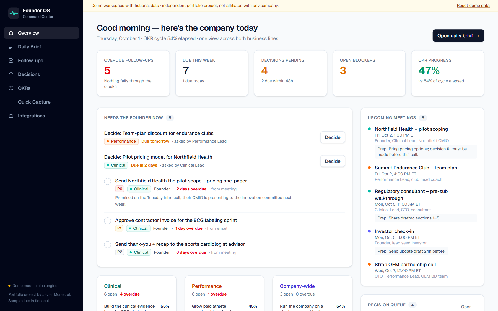
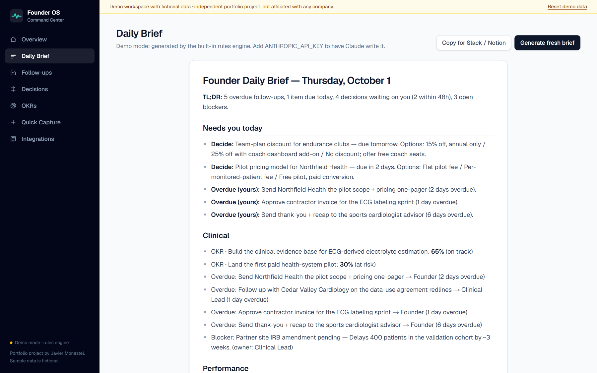
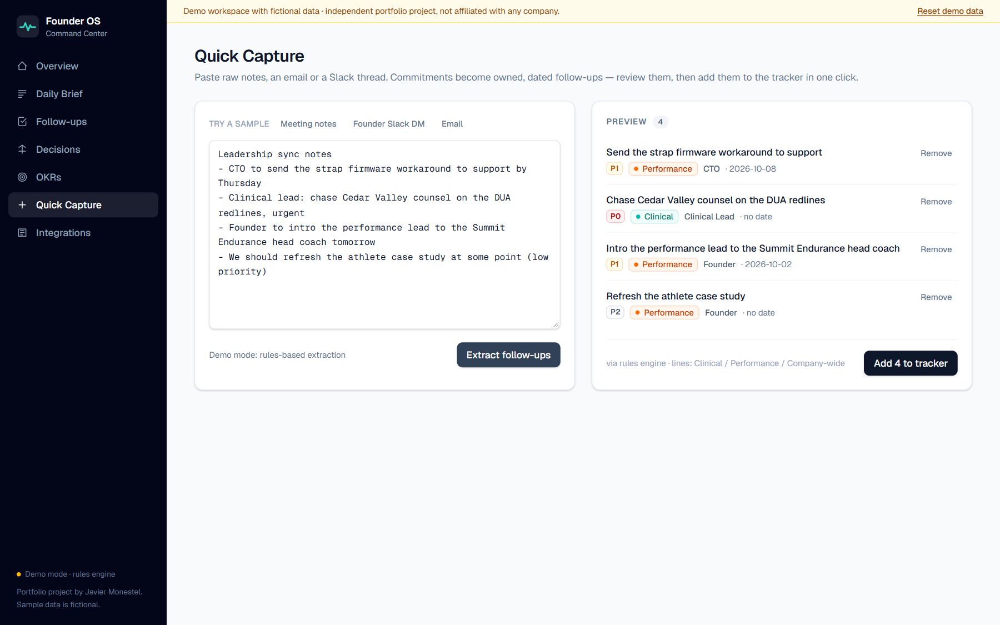
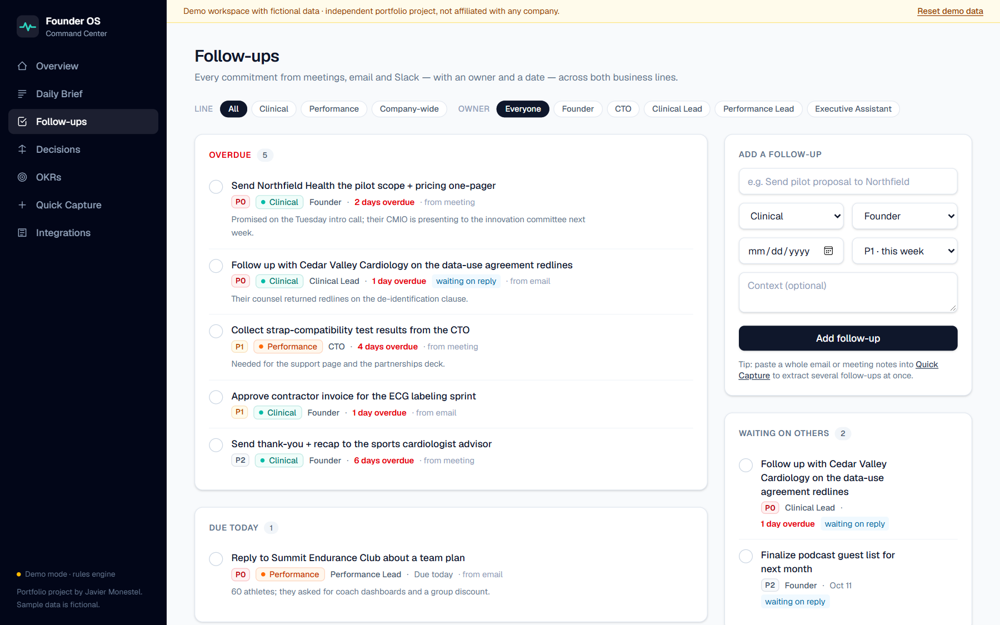
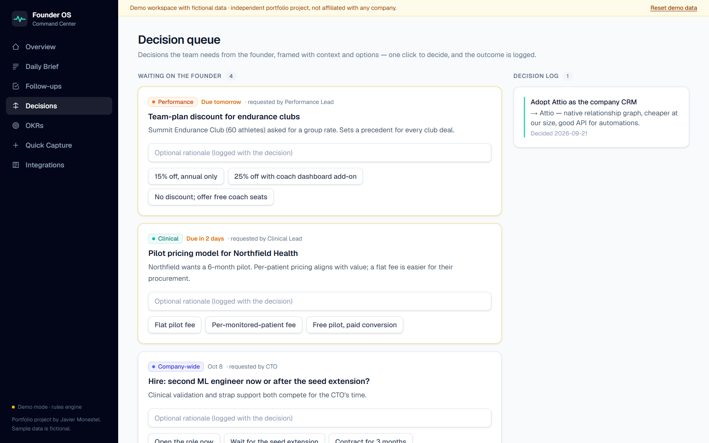
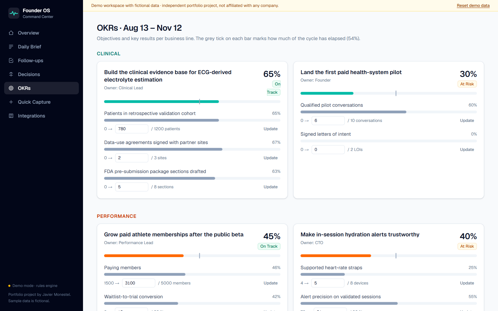
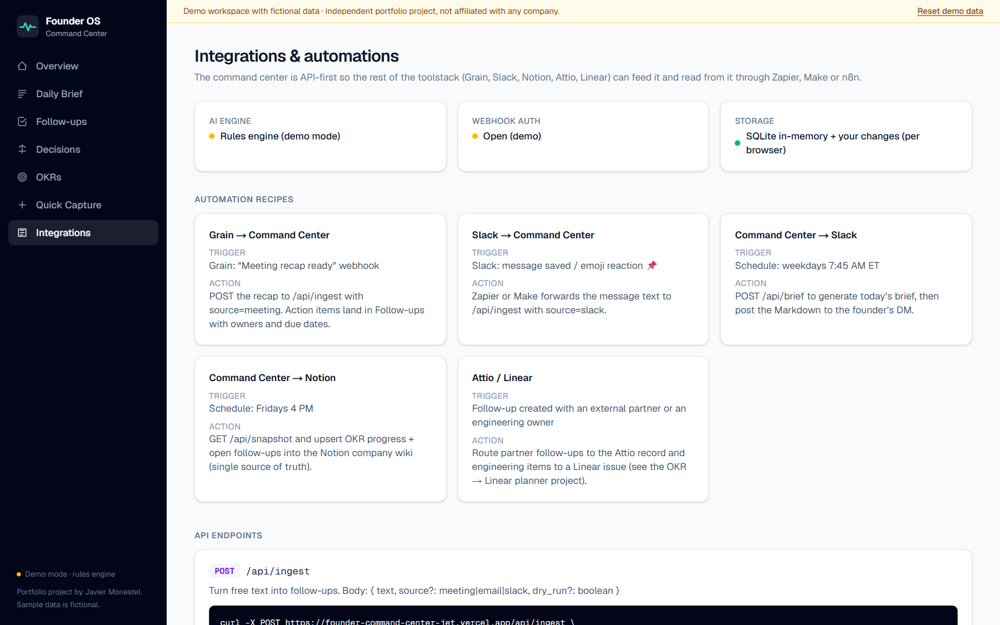
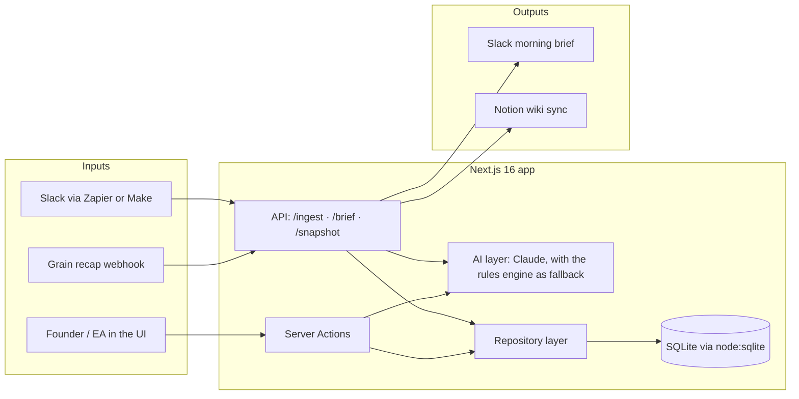

# Founder Command Center

**A chief-of-staff operating system for a founder running two business lines at once.**
OKRs, follow-ups, pending decisions, blockers and the calendar for a clinical vertical and a performance/wellness vertical, all in one view, plus an AI daily brief and AI quick capture powered by Claude.

[](https://founder-command-center-demo.vercel.app)
[](https://github.com/JavierMonestel/founder-command-center/actions/workflows/ci.yml)




> **Try it:** [founder-command-center-demo.vercel.app](https://founder-command-center-demo.vercel.app). You can click anything: mark follow-ups done, make decisions, update key results, paste notes into Quick Capture. Your changes are private to your browser, and **Reset demo data** restores everything.

---

## Why I built this

Early-stage founders who run **two verticals at once** (here, a clinical SaMD business that sells to health systems and a consumer performance membership for athletes) lose the most time to the work *between* tools:

- Commitments made in meetings, email and Slack never get an owner or a date, so **follow-ups fall through the cracks**.
- Decisions pile up waiting on the founder, with no context or options attached.
- OKR progress lives in one tool, tasks in another, notes in a third, so there is **no single source of truth**.

An AI-native executive assistant fixes this with **systems, not heroics**. This project is that system: a small full-stack app that sits on top of the toolstack (Notion, Grain, Attio, Linear, Slack) and gives the founder one place to see what needs them today.

## What it does

| | |
|---|---|
| **Overview.** One screen across both business lines: overdue follow-ups, decisions due in 48h, blockers, OKR health against the share of the cycle elapsed, and upcoming meetings with prep notes. |  |
| **AI Daily Brief.** Claude writes the founder's morning brief from a live snapshot of the company. It covers what needs a decision today, what is overdue and who owns it, and which low-priority items to delegate. Copy it to Slack or Notion in one click. |  |
| **Quick Capture.** Paste meeting notes, an email or a Slack thread. Claude (structured outputs) or the rules engine extracts owned, dated follow-ups; you review them and add them to the tracker. |  |
| **Follow-ups.** Every commitment with an owner, a date and a source (meeting, email, Slack). Bucketed into overdue, today, this week, later and waiting-on-others, with snooze and filters by line and owner. |  |
| **Decision queue.** Decisions the team needs from the founder, framed with context and options. One click decides, and the outcome and rationale go into a decision log. |  |
| **OKRs.** Objectives and key results per line, health against the cycle timeline (including "lower is better" KRs like *founder hours on admin*), with inline updates. |  |
| **Integrations.** An API-first design so Zapier, Make or n8n can push Grain recaps and Slack messages in, and pull the brief and snapshot out. |  |

## How AI is used (and kept safe)

| Feature | Model call | Guardrails |
|---|---|---|
| Daily brief | `claude-opus-5-5` via the Anthropic TypeScript SDK, adaptive thinking, `effort: medium` | The system prompt forbids inventing facts not in the snapshot; output is rendered by a minimal Markdown renderer that never injects HTML. |
| Quick capture | `messages.parse` with a **Zod schema** (structured outputs), `effort: low` | Owners are an enum, dates are resolved against today's date, and the user reviews every item before anything is saved. |
| Both | Server-side **refusal fallbacks** (`fallbacks: "default"`) | If the API is unavailable, the key is missing, or the model declines, the app falls back to a deterministic **rules engine**, so it never breaks. |

No API key? The app runs fully in **demo mode** with the rules engine. The hosted demo runs this way so it costs nothing to keep online.

## Architecture



- **Next.js 16** with React Server Components and Server Actions; there is no client-side state library.
- **SQLite through Node's built-in `node:sqlite`**, so there are no native addons to compile. Every write is a small serializable *operation* (`src/lib/ops.ts`):
  - **Local / self-hosted:** operations are applied to a SQLite file.
  - **Hosted demo (Vercel):** serverless instances don't share a disk. Each request builds a seeded in-memory database and replays *your* operations from a cookie, so every visitor gets a consistent, private sandbox.
- **Zod** validates every Server Action and API input.

## Automation recipes

| Recipe | Trigger | What happens |
|---|---|---|
| Grain → follow-ups | "Recap ready" webhook | `POST /api/ingest` with `source: "meeting"`; action items land with owners and dates |
| Slack → follow-ups | 📌 reaction (Zapier / Make) | Message text goes to `/api/ingest` with `source: "slack"` |
| Morning brief | Weekdays 7:45 AM ET | `POST /api/brief`, then the Markdown is posted to the founder's DM |
| Notion sync | Fridays 4 PM | `GET /api/snapshot`, then OKR progress and open follow-ups are upserted into the company wiki |

```bash
curl -X POST https://founder-command-center-demo.vercel.app/api/ingest \
  -H "Content-Type: application/json" \
  -d '{"text":"- CTO to share strap test results by Friday","source":"slack","dry_run":true}'
```

## Run it locally

```bash
git clone https://github.com/JavierMonestel/founder-command-center.git
cd founder-command-center
npm install
cp .env.example .env.local   # optional: add ANTHROPIC_API_KEY to enable Claude
npm run dev                  # http://localhost:3000
```

Requires **Node.js 22.13+** (uses the built-in `node:sqlite`). The database is created and seeded automatically in `./data/`.

| Variable | Purpose |
|---|---|
| `ANTHROPIC_API_KEY` | Enables Claude for briefs and capture. Without it, the rules engine is used. |
| `ANTHROPIC_MODEL` | Overrides the model (default `claude-opus-5-5`). |
| `INGEST_TOKEN` | When set, write endpoints require `Authorization: Bearer <token>`. |
| `DEMO_STORAGE` | `file` (default locally) or `cookie` (default on Vercel). |
| `DATABASE_PATH` | Custom SQLite file location. |

## Quality

```bash
npm test          # Vitest: capture parser, OKR math, brief builder, op replay
npm run typecheck # route types + tsc --noEmit
npm run lint
```

GitHub Actions runs lint, typecheck, tests and a production build on every push. The hosted demo was also checked with a browser end-to-end script (complete a follow-up, make a decision, capture notes, update a KR, generate a brief, reset).

## Project structure

```
src/
  app/                 routes: overview, brief, follow-ups, decisions, okrs, capture, integrations
    actions.ts         server actions (validated with Zod)
    api/               ingest / brief / snapshot endpoints for automations
  components/          UI primitives, item rows, Markdown renderer
  lib/
    ai.ts              Claude integration + fallbacks
    brief.ts           rules-engine brief + model snapshot
    capture.ts         rules-engine follow-up extraction
    ops.ts             serializable write operations
    store.ts           file vs. per-visitor cookie storage
    seed.ts            fictional demo company (dates relative to today)
```

## Roadmap

- Native Notion, Linear and Attio connectors (OAuth) in place of webhook recipes
- Postgres adapter for multi-user teams
- Weekly investor-update draft generated from KR deltas
- Slack slash command: `/capture <text>`

---

**Built by [Javier Monestel](https://github.com/JavierMonestel)** as a portfolio project exploring how an AI-native executive assistant can run a founder's operating system.
*Independent project. Not affiliated with, endorsed by, or built for any company. All organizations, people and figures in the demo are fictional.*
